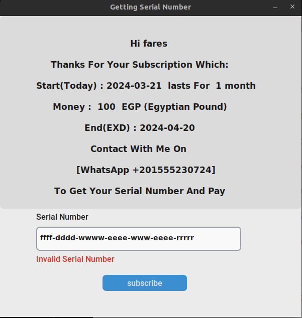

# subscription 

### this code help in managing the subscription process for a desktop app as follow :

+ ### collect some data from user 

    subscription period :
    - 1 month 
    - 6 months 
    - 1 year

#### then the app create a unique SERIAL-NUMBER depend on these info and with MAC address to make the SERIAL-NUMBER unique for each PC

### the App send a mail to me with the serial-number as follow:

### then the app show an ASSERTION window of subscription to user  to insert SERIAL-NUMBER That i give him it after contact me on WhatsApp as follow:

### if serial not-valid will show as follow:

## when the user insert a valid serial number the main app window will open as shown:

    if the subscription end the subscription window open and repeat the whole process again